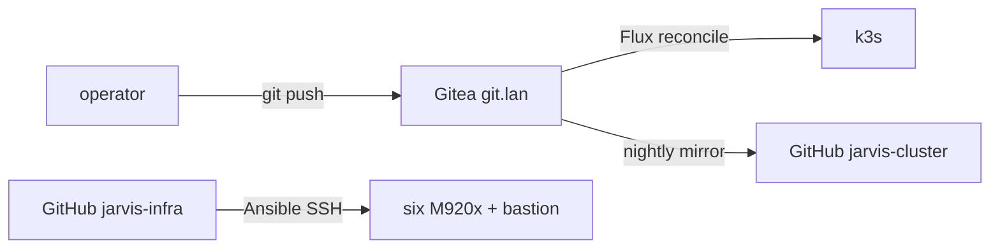
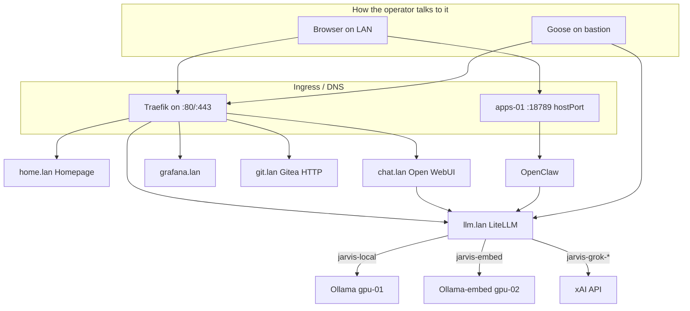

# JARVIS cluster (GitOps)

Flux source of truth for the running home lab. **Authoritative copy is Gitea**
`http://git.lan/jarvis/cluster.git`. This GitHub repo is a **mirror only** —
the admin should not open PRs here and expect Flux to see them.

Metal / OS / Ansible / rebuild: [gordoncooper/jarvis-infra](https://github.com/gordoncooper/jarvis-infra).

## Why two repos

The admin pushes app YAML to **Gitea** and bootstrap/docs to **jarvis-infra**.

## Cluster layout

Six ThinkCentre M920x (i7-8700T, 32 GiB, Ubuntu 26.04) + bastion. k3s v1.36
single-server etcd on ctrl-01. Traefik Ingress. mkcert LAN TLS.

| URL | App | Notes |
|---|---|---|
| https://home.lan | Homepage | Command board |
| https://chat.lan | Open WebUI | Voice + RAG. Pin image tag, not `:main` |
| https://grafana.lan | Grafana | NVIDIA dashboard 14574 |
| https://llm.lan/v1 | LiteLLM | Goose `OPENAI_HOST` is this, **no** extra `/v1` |
| http://git.lan | Gitea | Stays HTTP on purpose |
| http://agent.lan:18789 | OpenClaw | `:80` returns 403 / proxy_attribution |

## Node roles (what Flux schedules)

| Node | Labels | Workloads |
|---|---|---|
| ctrl-01 | `jarvis.role=control` | Gitea, Flux, Traefik |
| gpu-01 | `jarvis.role=gpu` `jarvis.gpu=chat` | `deploy/ollama` |
| gpu-02 | `jarvis.role=gpu` `jarvis.gpu=perception` | `deploy/ollama-embed` |
| data-01 | `jarvis.storage=primary` | NFS server (host, not a pod) |
| data-02 | `jarvis.storage=replica` | Prometheus, Grafana, kube-state-metrics |
| apps-01 | `jarvis.role=apps` | Open WebUI, LiteLLM, Piper, OpenClaw, Homepage |

Tree Flux applies:

    clusters/jarvis/
      kustomization.yaml
      flux-system/  inference/  apps/  agents/  monitoring/  tls/

## Models and money

| LiteLLM name | Backend | Cost |
|---|---|---|
| `jarvis-local` | Ollama 7B on gpu-01 | electricity |
| `jarvis-embed` | nomic-embed on gpu-02 | electricity |
| `jarvis-grok` | `xai/grok-4-fast` | API |
| `jarvis-grok-code` | `xai/grok-code-fast-1` | API — OpenClaw + Goose default |

OpenClaw `/usage` counts **gateway** tokens (tools + context), not the xAI
invoice. Source of truth: [console.x.ai](https://console.x.ai).

## Operator loop

    cd ~/cluster
    git pull
    git add clusters/jarvis && git commit && git push
    flux reconcile kustomization flux-system --with-source --timeout=3m
    ~/jarvis-infra/scripts/smoke-operator.sh

Do **not** `kubectl apply` from Goose/OpenClaw except read-only. YAML belongs
in this repo.

More: [docs/SMOKE-OPERATOR.md](docs/SMOKE-OPERATOR.md) ·
[docs/LESSONS.md](docs/LESSONS.md) · [docs/RESTORE.md](docs/RESTORE.md).
