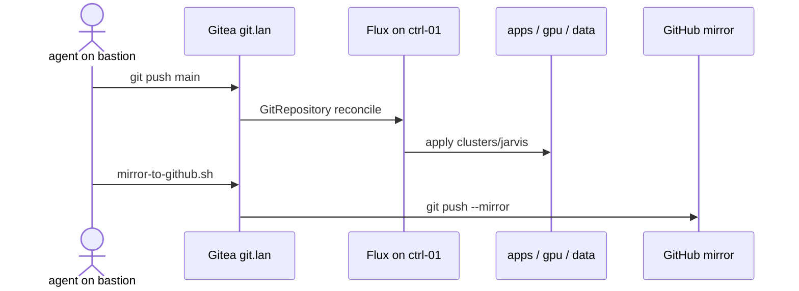
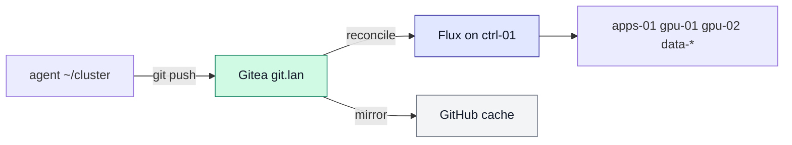
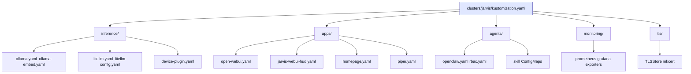
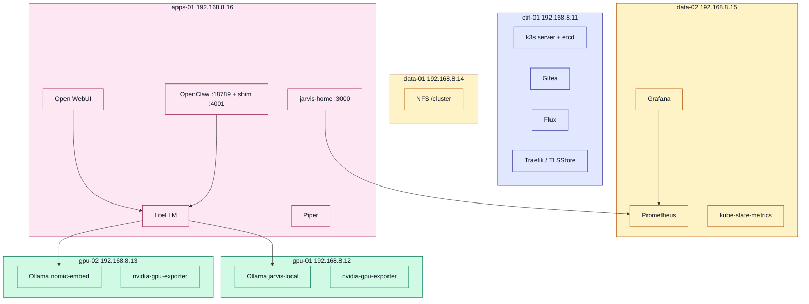
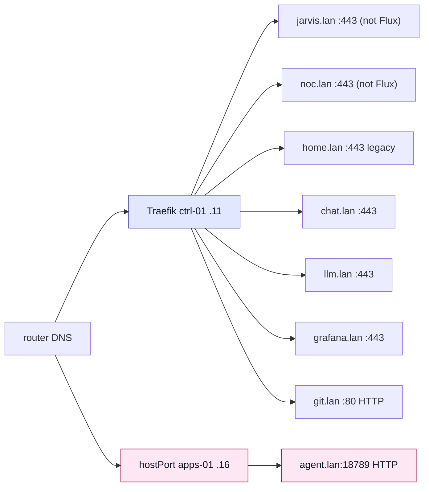
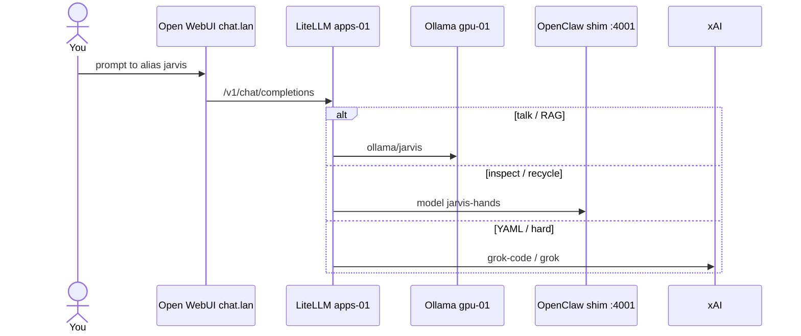
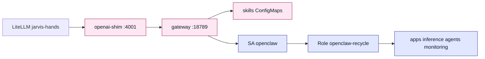
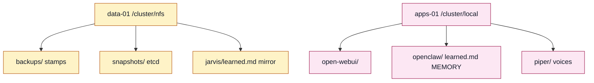

# JARVIS cluster (Flux YAML)

Maturity is infra `VERSION` `MATURITY` (not copied here). License: [MIT](LICENSE).

Flux YAML for the six-node k3s lab. **Gitea is origin.** This GitHub
repository is a **mirror**. Do not point Flux at GitHub.

Metal, Ansible, scripts, and the homepage **image** live in
[gordoncooper/jarvis-infra](https://github.com/gordoncooper/jarvis-infra).

This file is the map of **what Flux applies**. Operator contract, discover,
and rebuild live in infra (`AGENTS.md`, `docs/COPILOT.md`, `docs/OPERATING.md`).
This repo's [AGENTS.md](AGENTS.md) is a stub — no second bible.

If you opened a **laptop GitHub clone**: it is a cache. Do not `git push`
this remote as origin. Do not kubectl from a laptop. Edit `~/cluster` on
the bastion as user **agent** and push to Gitea.

Canonical pins: `~/jarvis-infra/VERSION` on the bastion. Do not copy
git/image tags into this file.

| | |
| --- | --- |
| Flux origin | `http://git.lan/jarvis/cluster.git` |
| Path Flux reads | `./clusters/jarvis` (do not rename) |
| k3s | single-server etcd on ctrl-01 (`K3S` in infra VERSION) |
| Glass | **jarvis.lan** is the product; **noc.lan** is the operator surface (D-0002). chat.lan and agent.lan are break-glass. |

`noc.lan` is served by `jarvis-noc`, reconciled from this repo since D-0038.
Its **image** is built out of band by `jarvis-infra apps/jarvis-noc/install-noc.sh`,
because `imagePullPolicy: Never` means Flux cannot pull it — build first, then
reconcile. `home.lan` (`apps/homepage.yaml`) is legacy and retiring into
noc.lan; it still serves.

## Use cases

- **Local chat** — Open WebUI → LiteLLM → Ollama 7B Q6 on gpu-01.
- **Grok on demand** — same OpenAI-shaped API, `jarvis-grok` / `jarvis-grok-code`.
- **RAG** — embeddings on gpu-02, knowledge in Open WebUI (`lab-docs`, `jarvis-learned`).
- **Voice** — Whisper STT on chat.lan; Piper TTS on apps-01.
- **Hands** — in-glass `jarvis-hands` (OpenClaw shim in the OpenClaw pod).
- **See the rack** — https://noc.lan (https://home.lan is legacy) and https://grafana.lan.
- **GitOps** — edit YAML as `agent`, push Gitea, Flux reconciles.

Do not add exact-phrase `keyword_tier_rules`. Prefer vendor knobs
(LiteLLM config, OpenClaw skills, k8s RBAC).

## GitOps path

## Tree

Keep `path: ./clusters/jarvis`. Gitea is the Flux GitRepository URL.

## Namespaces and placement

Bastion (192.168.8.10) is omitted — not a k3s node.

| Path | Namespace | What |
| --- | --- | --- |
| jarvis-infra `bootstrap/gitea.yaml` (not Flux) | gitea | git.lan |
| `clusters/jarvis/inference/` | inference | Ollama, embed, LiteLLM, RuntimeClass, device plugin |
| `clusters/jarvis/apps/` | apps | Open WebUI, Piper, homepage, HUD ConfigMap |
| `clusters/jarvis/agents/` | agents | OpenClaw, shim, skills, RBAC |
| `clusters/jarvis/monitoring/` | monitoring | Prometheus, Grafana, exporters |
| `clusters/jarvis/tls/` | traefik | mkcert TLSStore |

Node labels: `jarvis.role=control|gpu|storage|apps`.

## Ingress

`agent.lan` must resolve to **192.168.8.16**. Traefik on ctrl-01 cannot
hold that hostPort. `git.lan` stays HTTP on purpose (Flux origin).

## Router (chat.lan)

Default alias is `jarvis` (LiteLLM `complexity_router`).
Picker stays as Tony's hatch. Prefixes `local:` `hands:` `code:` `grok:`
are an Open WebUI filter — do not grow that pet. Do not add keyword rules.

Ollama, Piper, LiteLLM, monitoring images are **digest-pinned**
(`:tag@sha256:…`, `IfNotPresent`). Homepage is **not** pulled — see below.

## OpenClaw (Hands)

In-glass only for normal use. http://agent.lan:18789 and
`jarvis-infra/scripts/openclaw-ask.sh` are break-glass.
Writes in git today: recycle (pod delete + deploy patch). Not cluster-admin.
**Cat live RBAC before widening.** Recycle the pod → re-pair the Control UI.

## Homepage contract

Image is built on apps-01 from jarvis-infra (`install-jarvis-home.sh` reads
`VERSION`) **before** Flux applies `homepage.yaml`. `imagePullPolicy: Never`.
SA `homepage` lists events, pods, nodes, Flux CRs.

Keep `clusters/jarvis/apps/homepage.yaml` in lockstep with
`jarvis-infra/apps/jarvis-home/homepage.yaml`.
`check-contract.sh` compares both.

HUD chrome for chat.lan is `clusters/jarvis/apps/jarvis-webui-hud.yaml`
(ConfigMap inject). Chrome is not routing.

## Data plane

hostPath is the live app data. NFS is backup + learned mirror.
Do not commit `learned.md`.

## Change YAML

Work on the bastion clone of **Gitea**, not GitHub.

1. `cd ~/cluster` as user **agent**
2. Edit `clusters/jarvis/...` (keep `path: ./clusters/jarvis`)
3. `git push origin main` → `http://git.lan/jarvis/cluster.git`
4. Flux applies in about a minute, or:

       flux reconcile kustomization flux-system --with-source

5. Proof lives in infra: `~/jarvis-infra/scripts/verify-jarvis.sh`
6. Mirror (or wait for 03:30): `~/jarvis-infra/scripts/mirror-to-github.sh`

Example — digest pin lives on the container `image:` field as
`tag@sha256:…` plus `imagePullPolicy: IfNotPresent`. Homepage stays `Never`.

## Docs and scripts (infra)

Scripts (`check-contract.sh`, `verify-jarvis.sh`, backup, discover) live in
`~/jarvis-infra/scripts/`. This repo is YAML only.

- [COPILOT](https://github.com/gordoncooper/jarvis-infra/blob/main/docs/COPILOT.md)
- [OPERATING](https://github.com/gordoncooper/jarvis-infra/blob/main/docs/OPERATING.md)
- [INTERACT](https://github.com/gordoncooper/jarvis-infra/blob/main/docs/INTERACT.md)
- [REBUILD](https://github.com/gordoncooper/jarvis-infra/blob/main/docs/REBUILD.md)
- [RESTORE](https://github.com/gordoncooper/jarvis-infra/blob/main/docs/RESTORE.md)
- [LESSONS](https://github.com/gordoncooper/jarvis-infra/blob/main/docs/LESSONS.md)
- [PLAN](https://github.com/gordoncooper/jarvis-infra/blob/main/docs/PLAN.md)
