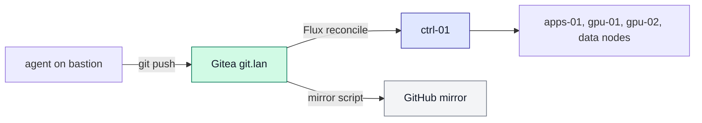
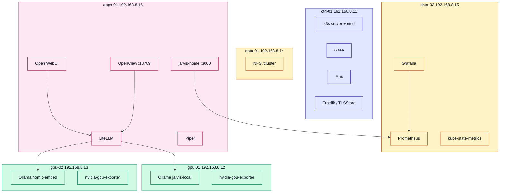

# JARVIS home cluster

Flux YAML. Gitea is origin. This GitHub repo is a mirror. Do not point Flux at GitHub.

Canonical pins: ~/jarvis-infra/VERSION

| Item | Value |
| --- | --- |
| Pins | ~/jarvis-infra/VERSION |
| Flux origin | http://git.lan/jarvis/cluster.git |

## GitOps path

## Workloads by node

Live Flux path: clusters/jarvis/apps/homepage.yaml
imagePullPolicy Never. SA homepage. Image from infra VERSION.

| Tag | What |
| --- | --- |
| v0.4.8 | event stream |
| v0.4.9 | colored README diagrams |
| v0.4.10 | VERSION contract |
