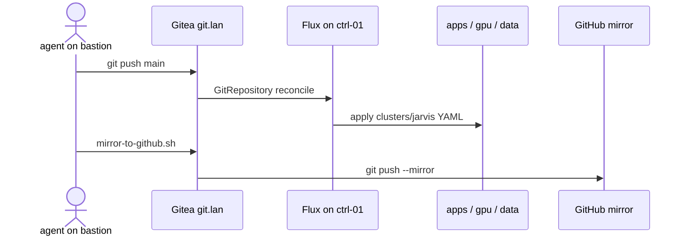
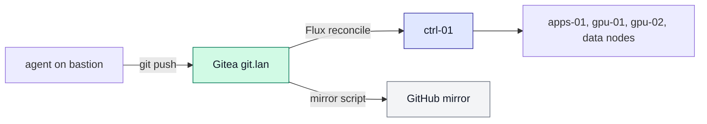
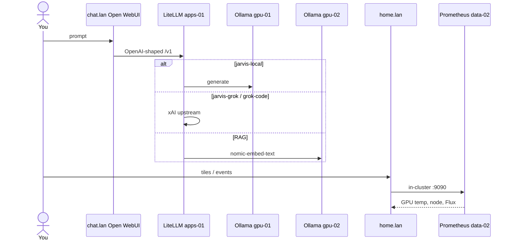
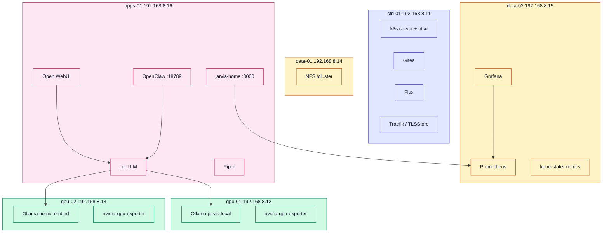

# JARVIS home cluster

Flux YAML for a six-node k3s inference lab. **Gitea is origin.** This GitHub
repo is a **mirror**. Do not point Flux at GitHub.

Metal, Ansible, and the homepage **image** live in
[gordoncooper/jarvis-infra](https://github.com/gordoncooper/jarvis-infra).

**Canonical pins:** `jarvis-infra/VERSION` on the bastion
(`~/jarvis-infra/VERSION`). Do not copy git/image tags into this file as
source of truth. New AI / copilot: read jarvis-infra **`docs/COPILOT.md`** first, then `docs/OPERATING.md` (then LESSONS) before changing YAML.

| Item | Value |
| --- | --- |
| Pins | `~/jarvis-infra/VERSION` (`GIT_TAG` + `IMAGE`) |
| Flux origin | http://git.lan/jarvis/cluster.git |
| k3s | single-server etcd on ctrl-01 (`K3S` in VERSION) |

## Use cases

- **Local chat** — Open WebUI to LiteLLM to Ollama 7B Q6 on gpu-01 (electricity only).
- **Grok on demand** — same OpenAI-shaped API, models jarvis-grok / jarvis-grok-code via xAI.
- **RAG** — embeddings on gpu-02 (nomic-embed-text), knowledge in Open WebUI.
- **Voice** — Whisper STT on chat.lan (HTTPS); Piper TTS on apps-01.
- **Hands on the cluster** — OpenClaw at http://agent.lan:18789 (hostPort on apps-01).
- **See the rack** — https://home.lan (click tiles for host/GPU/service dossiers + pods) and https://grafana.lan (14574).
- **GitOps** — edit YAML in cluster as user agent, push Gitea, Flux reconciles.

## GitOps path

## Inference and telemetry data path

## Workloads by node

Bastion (192.168.8.10) is omitted — it is not a k3s node.

## Namespaces (this tree)

| Path | Namespace | What |
| --- | --- | --- |
| jarvis-infra `bootstrap/gitea.yaml` (not Flux) | gitea | git.lan |
| clusters/jarvis/inference/ | inference | Ollama, embed, LiteLLM, RuntimeClass |
| clusters/jarvis/apps/ | apps | Open WebUI, Piper, homepage (image from infra VERSION) |
| clusters/jarvis/agents/ | agents | OpenClaw + RBAC + skills |
| clusters/jarvis/monitoring/ | monitoring | Prometheus, Grafana, exporters |
| clusters/jarvis/tls/ | traefik | mkcert TLSStore for LAN names |

Homepage contract: image is built on apps-01 from jarvis-infra
(`install-jarvis-home.sh` reads `VERSION`) before Flux applies homepage.yaml.
`imagePullPolicy: Never`. SA `homepage` lists Events + Flux CRs.

Live path on the bastion clone is `clusters/jarvis/apps/homepage.yaml`
(same file Flux applies). Keep it in lockstep with
`jarvis-infra/apps/jarvis-home/homepage.yaml` — `check-contract.sh` compares both.

## URLs

| URL | App |
| --- | --- |
| https://home.lan | Command center (Home + /status + /api/telemetry) |
| https://chat.lan | Open WebUI |
| http://agent.lan:18789 | OpenClaw (not :80, not ctrl-01) |
| https://llm.lan/v1 | LiteLLM |
| http://git.lan | Gitea |
| https://grafana.lan | Grafana |

## Change YAML

Work on the bastion clone of **Gitea**, not GitHub.

1. `cd ~/cluster` as user **agent**
2. Edit `clusters/jarvis/...` (keep `path: ./clusters/jarvis` — do not rename)
3. `git push origin main` → `http://git.lan/jarvis/cluster.git`
4. Flux applies in about a minute, or `flux reconcile kustomization flux-system --with-source`
5. Proof lives in infra: `~/jarvis-infra/scripts/verify-jarvis.sh`
6. Mirror (or wait for the 03:30 backup): `~/jarvis-infra/scripts/mirror-to-github.sh`

Ollama, Piper, and LiteLLM images are **digest-pinned** in YAML (`:tag@sha256:…`,
`IfNotPresent`). Homepage image is **not** pulled: it is imported on apps-01
from jarvis-infra (`imagePullPolicy: Never`). Do not float those back to `:latest`.

## Docs and scripts

Canonical operator docs live in **jarvis-infra**:
[OPERATING](https://github.com/gordoncooper/jarvis-infra/blob/main/docs/OPERATING.md),
[INTERACT](https://github.com/gordoncooper/jarvis-infra/blob/main/docs/INTERACT.md),
[REBUILD](https://github.com/gordoncooper/jarvis-infra/blob/main/docs/REBUILD.md),
[RESTORE](https://github.com/gordoncooper/jarvis-infra/blob/main/docs/RESTORE.md),
[LESSONS](https://github.com/gordoncooper/jarvis-infra/blob/main/docs/LESSONS.md).
`docs/history/` there is frozen (PHASE snapshots). Do not rewrite them.

Scripts (`check-contract.sh`, `verify-jarvis.sh`, backup, reboot, smoke)
live in `~/jarvis-infra/scripts/`. This repo is Flux YAML only.
