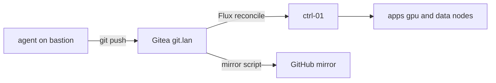
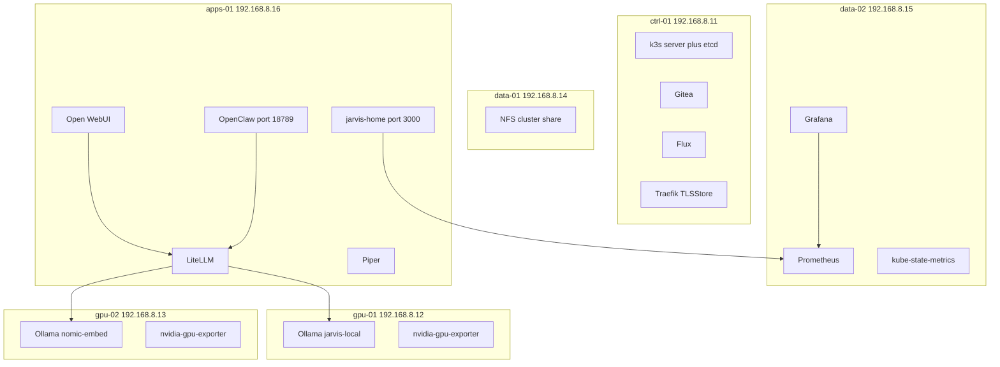

# JARVIS home cluster

Flux YAML for a six-node k3s inference lab. **Gitea is origin.** This GitHub
repo is a **mirror**. Do not point Flux at GitHub.

Metal and the homepage image live in
[gordoncooper/jarvis-infra](https://github.com/gordoncooper/jarvis-infra).

Read [docs/LESSONS.md](docs/LESSONS.md) before changing anything.

- Known-good git tag: **v0.4.7**. Image **jarvis-home:v0.4.5**.
- Flux origin: http://git.lan/jarvis/cluster.git
- k3s: v1.36.4+k3s1, single-server etcd on ctrl-01

## Use cases

- **Local chat** — Open WebUI to LiteLLM to Ollama 7B Q6 on gpu-01.
- **Grok on demand** — jarvis-grok / jarvis-grok-code via xAI.
- **RAG** — nomic-embed-text on gpu-02.
- **Voice** — Whisper STT on chat.lan; Piper on apps-01.
- **Hands on the cluster** — OpenClaw at http://agent.lan:18789.
- **See the rack** — https://home.lan and https://grafana.lan.
- **GitOps** — edit YAML in ~/cluster as agent, push Gitea, Flux reconciles.

## GitOps path

## Workloads by node

Bastion 192.168.8.10 is not a k3s node.

## Namespaces

- k8s/gitea — git.lan
- k8s/inference — Ollama, embed, LiteLLM
- k8s/apps — Open WebUI, Piper, homepage jarvis-home:v0.4.5
- k8s/agents — OpenClaw
- k8s/monitoring — Prometheus, Grafana, exporters
- k8s/tls — mkcert TLSStore

Build the homepage image on apps-01 before Flux applies homepage.yaml.

## URLs

- https://home.lan
- https://chat.lan
- http://agent.lan:18789
- https://llm.lan/v1
- http://git.lan
- https://grafana.lan

Tags: v0.4.4 command center, v0.4.5 Prometheus tiles, v0.4.6 first README,
**v0.4.7** mermaid GitHub can render.
