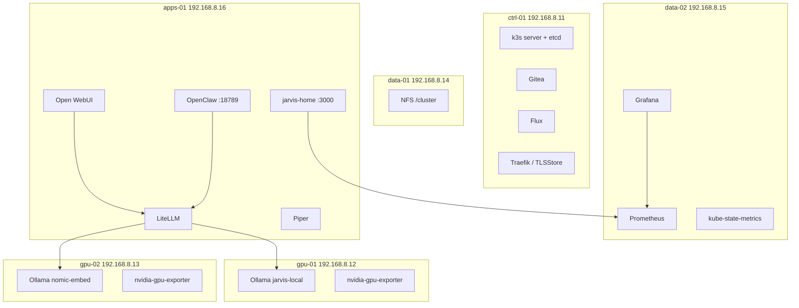

# JARVIS home cluster

Flux YAML for a six-node k3s inference lab. **Gitea is origin.** This GitHub
repo is a **mirror** (`git push --mirror`). Do not point Flux at GitHub.

Metal, Ansible, and the homepage **image** live in
[`gordoncooper/jarvis-infra`](https://github.com/gordoncooper/jarvis-infra).

Read [docs/LESSONS.md](docs/LESSONS.md) before changing anything.

| Item | Value |
| --- | --- |
| Known-good git tag | **v0.4.6** (this README). Image **jarvis-home:v0.4.5**. |
| Flux origin | `http://git.lan/jarvis/cluster.git` |
| k3s | `v1.36.4+k3s1`, single-server etcd on ctrl-01 |

## Use cases

- **Local chat** — Open WebUI → LiteLLM → Ollama 7B Q6 on gpu-01 (electricity only).
- **Grok on demand** — same OpenAI-shaped API, models `jarvis-grok` / `jarvis-grok-code` via xAI.
- **RAG** — embeddings on gpu-02 (`nomic-embed-text`), knowledge in Open WebUI.
- **Voice** — Whisper STT on chat.lan (HTTPS); Piper TTS on apps-01.
- **Hands on the cluster** — OpenClaw at `http://agent.lan:18789` (hostPort on apps-01).
- **See the rack** — https://home.lan (command center) and https://grafana.lan (14574).
- **GitOps** — edit YAML in `~/cluster` as user `agent`, push Gitea, Flux reconciles.

## GitOps path

```mermaid
flowchart LR
  Dev[agent@bastion ~/cluster] -->|git push| Gitea[git.lan jarvis/cluster]
  Gitea -->|Flux reconcile| Ctrl[ctrl-01]
  Ctrl --> Apps[apps-01 · gpu-01 · gpu-02 · data-*]
  Gitea -->|mirror-to-github.sh| GH[GitHub mirror]
```

## Workloads by node



Bastion (`192.168.8.10`) is not in this diagram. It is not a k3s node.

## Namespaces (this tree)

| Path | Namespace | What |
| --- | --- | --- |
| `k8s/gitea/` | gitea | git.lan |
| `k8s/inference/` | inference | Ollama, embed, LiteLLM, RuntimeClass |
| `k8s/apps/` | apps | Open WebUI, Piper, **homepage** (`jarvis-home:v0.4.5`) |
| `k8s/agents/` | agents | OpenClaw + RBAC + skills |
| `k8s/monitoring/` | monitoring | Prometheus, Grafana, exporters |
| `k8s/tls/` | traefik | mkcert TLSStore for `*.lan` |

Homepage contract: image is **built on apps-01** from jarvis-infra
(`install-jarvis-home.sh`) **before** Flux applies `k8s/apps/homepage.yaml`.
`imagePullPolicy: Never`. `PROMETHEUS_URL=http://prometheus.monitoring.svc:9090`.

## URLs

| URL | App |
| --- | --- |
| https://home.lan | Command center (Home + `/status` + `/api/telemetry`) |
| https://chat.lan | Open WebUI |
| http://agent.lan:18789 | OpenClaw (not :80, not ctrl-01) |
| https://llm.lan/v1 | LiteLLM |
| http://git.lan | Gitea |
| https://grafana.lan | Grafana |

## History

PHASE1–22 markdown in this repo. Snapshot tags: v0.4.4 command center,
v0.4.5 Prometheus tiles, **v0.4.6** architecture READMEs.
